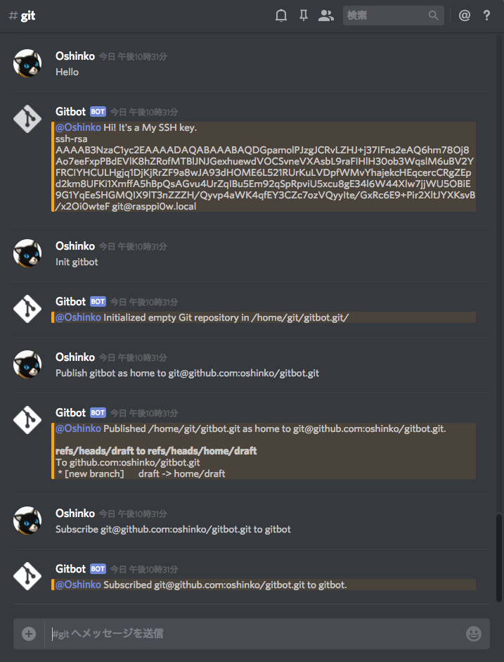

# Gitbot


This is a Git agent on the local network, running on Discord and Slack.



## Installation

It's a very small package, so you can easily install, update and delete it.

```bash
python -m pip install -U -e git+https://github.com/oshinko/bot.git@next#egg=bot-0.0.0
python -m pip install -U -e git+https://github.com/oshinko/gitbot.git@draft#egg=gitbot-0.0.0
```

## Startup

```bash
python -m bot --space bot.spaces.Discord \
              --token ${BOT_TOKEN} \
              --modules gitbot \
              --errorsto "#errors"
```

## Commands

See the [real code](gitbot.py).

### Hello

Return information including SSH key.

```bash
hello
```

### Init

Create an empty Git repository.

```bash
init <repo>
```

### Publish

リポジトリをリモートリポジトリに転送します。

```bash
publish <local-repo> as <name> to <remote-repo>
```

### Subscribe

リモートリポジトリをリポジトリに紐付けます。

その後、購読という形で定期的に同期 (fetch) されます。

```bash
subscribe <remote-repo> to <local-repo>
```

## Installing on Raspbian

### Installing Python 3.6

```bash
sudo apt-get update
sudo apt-get install build-essential tk-dev libncurses5-dev libncursesw5-dev libreadline6-dev libdb5.3-dev libgdbm-dev libsqlite3-dev libssl-dev libbz2-dev libexpat1-dev liblzma-dev zlib1g-dev
wget https://www.python.org/ftp/python/3.6.5/Python-3.6.5.tar.xz
tar xf Python-3.6.5.tar.xz
cd Python-3.6.5
./configure
make
sudo make altinstall
```

### Installing Git

```bash
sudo apt-get install git
```

### Configuring User

```bash
sudo useradd -m -s /bin/bash git
sudo su - git
```

```bash
ssh-keygen -f $HOME/.ssh/id_rsa -C git@rasppi0w.local -q -N ""
```

```bash
python3.6 -m venv .venv
.venv/bin/python -m pip install -U -e git+https://github.com/oshinko/bot.git@next#egg=bot-0.0.0
.venv/bin/python -m pip install -U -e git+https://github.com/oshinko/gitbot.git@draft#egg=gitbot-0.0.0
```

```bash
cat <<EOF> .gitbot
GIT_SSH_COMMAND="ssh -o StrictHostKeyChecking=no"
GITBOT_TOKEN=YOUR_BOT_TOKEN
GITBOT_CHANNELS="#your-favorite-channel-1 #your-favorite-channel-2"
EOF
```

```bash
logout
```

### Configuring Systemd

```bash
sudo wget -O /etc/systemd/system/gitbot.service https://raw.githubusercontent.com/oshinko/gitbot/draft/gitbot.service
sudo systemctl start gitbot.service
sudo systemctl status gitbot.service
sudo systemctl enable gitbot.service
sudo service gitbot restart
```

### Cleanup (Optional)

```bash
sudo rm -r Python-3.6.5
rm Python-3.6.5.tar.xz
sudo apt-get --purge remove build-essential tk-dev
sudo apt-get --purge remove libncurses5-dev libncursesw5-dev libreadline6-dev
sudo apt-get --purge remove libdb5.3-dev libgdbm-dev libsqlite3-dev libssl-dev
sudo apt-get --purge remove libbz2-dev libexpat1-dev liblzma-dev zlib1g-dev
sudo apt-get autoremove
sudo apt-get clean
```
